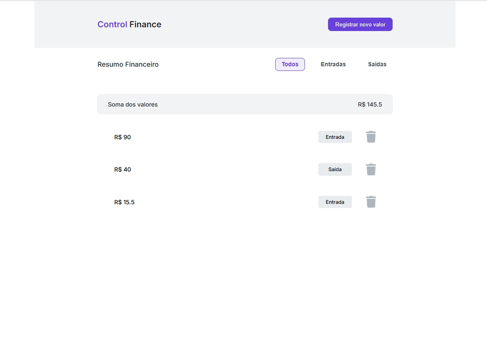
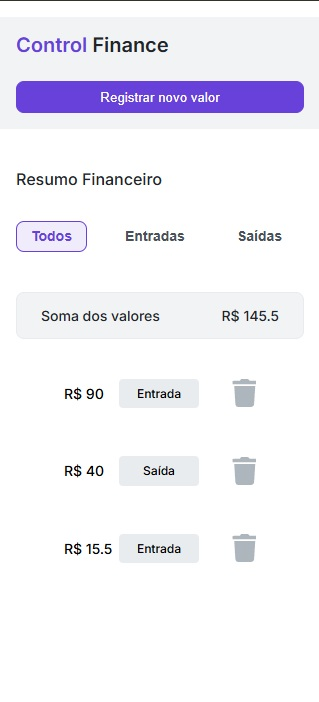

# 💰 Projeto: Control Finance

Este projeto foi desenvolvido como parte do curso da Kenzie Academy. O objetivo é criar uma aplicação web de controle financeiro que permite ao usuário cadastrar valores, classificá-los como entradas ou saídas, visualizar totais e aplicar filtros por tipo de transação.

---

## 📋 Descrição

A aplicação oferece as seguintes funcionalidades:

- Cadastro de valores financeiros (entrada ou saída);
- Visualização de todos os valores ou filtragem por categoria;
- Cálculo automático do total conforme o filtro selecionado;
- Remoção de valores cadastrados.

---

## 🚀 Tecnologias Utilizadas

- HTML5
- CSS3
- JavaScript (ES6)

---

## 📱 Adaptação Responsiva

- Utilização de media queries para adaptar o layout para as seguintes resoluções:
  - 1024px (tablets)
  - 768px (tablets)
  - 425px (dispositivos móveis)
- Ajustes em fontes, espaçamentos e posicionamentos para garantir uma experiência de usuário coesa em diferentes dispositivos;

---

## 🧩 Funcionalidades

### ⌨️ Cadastro

- Inserir novo valor financeiro com tipo (entrada ou saída);
- Adicionar os valores na lista da aplicação;
- Exibir a soma total de todos os valores cadastrados.

### 📊 Filtro

- Filtrar os valores por tipo (entrada ou saída);
- Atualizar o total de acordo com o filtro aplicado.

### 🗑 Remoção

- Remover valores da lista visual e do armazenamento de dados.

---

## 🖼️ Capturas de Tela

### 💻 Versão Desktop



### 📱 Versão Mobile



---

## 🖥️ Clonar o Projeto

1. Clone o repositório:

   ```bash
   git clone https://github.com/dkrausz/control-finance.git
   ```

2. Abra a pasta do projeto:

   ```bash
    cd control-finance
   ```

3. Abra o arquivo index.html no navegador:

- Pode dar duplo clique no arquivo, ou

- Usar uma extensão como Live Server no VS Code.

---

## 🔗 Acesso ao Projeto

- Repositório GitHub:[https://github.com/dkrausz/control-finance](https://github.com/dkrausz/control-finance)
- GitHub Pages: [https://dkrausz.github.io/control-finance/](https://dkrausz.github.io/control-finance/)

---

## 📝 Licença

Este projeto é de uso educacional e não possui uma licença específica.
